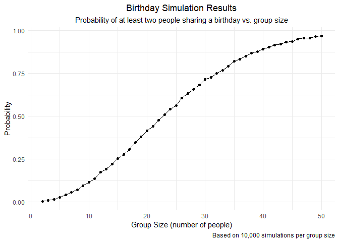
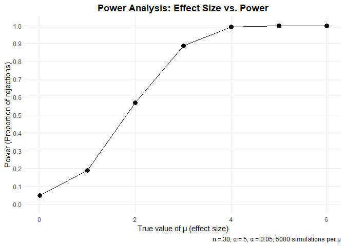
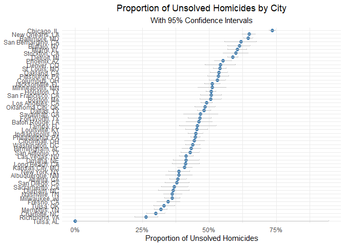

p8105_hw5_LC4052
================
2025-11-05

``` r
library(tidyverse)
```

    ## ── Attaching core tidyverse packages ──────────────────────── tidyverse 2.0.0 ──
    ## ✔ dplyr     1.1.4     ✔ readr     2.1.5
    ## ✔ forcats   1.0.0     ✔ stringr   1.5.2
    ## ✔ ggplot2   3.5.2     ✔ tibble    3.3.0
    ## ✔ lubridate 1.9.4     ✔ tidyr     1.3.1
    ## ✔ purrr     1.1.0     
    ## ── Conflicts ────────────────────────────────────────── tidyverse_conflicts() ──
    ## ✖ dplyr::filter() masks stats::filter()
    ## ✖ dplyr::lag()    masks stats::lag()
    ## ℹ Use the conflicted package (<http://conflicted.r-lib.org/>) to force all conflicts to become errors

``` r
library(rvest)
```

    ## 
    ## Attaching package: 'rvest'
    ## 
    ## The following object is masked from 'package:readr':
    ## 
    ##     guess_encoding

``` r
library(broom)
library(dplyr)
library(ggplot2)
library(knitr)
```

# Problem 1

## Write a function

``` r
bday_sim = function(n_room){
  
  birthdays = sample(1:365, n_room, replace = TRUE)
  
  repeated_bday = length(unique(birthdays)) < n_room
  
  repeated_bday

}
```

## Simulation

``` r
bday_sim_results = 
  expand_grid(
    bdays = 2:50,
    iter = 1:10000
  ) |>
  mutate(
    result = map_lgl(bdays, bday_sim)
  ) |>
  group_by(
    bdays
  ) |>
  summarize(
    prob_repeat = mean(result)
  )
```

## Make a plot

``` r
bday_sim_results |>
  ggplot(aes(x = bdays, y = prob_repeat)) +
  geom_point() +
  geom_line() +
  labs(
    title = "Birthday Simulation Results",
    subtitle = "Probability of at least two people sharing a birthday vs. group size",
    x = "Group Size (number of people)",
    y = "Probability",
    caption = "Based on 10,000 simulations per group size"
  ) +
  theme_minimal() +
  theme(
    plot.title = element_text(hjust = 0.5),
    plot.subtitle = element_text(hjust = 0.5)
  ) 
```

<!-- -->
When group size is 23, the probability that at least two people share a
birthday is approximately 50%. When group size is 50, the probability
approaches 100%.

# Problem 2

``` r
# Write the function
sim_mean_sd = function(n = 30, mu = 0, sigma = 5) {
  
  x = rnorm(n, mean = mu, sd = sigma)
  
  tidy_result = broom::tidy(t.test(x, mu = 0))
  
  tibble(
    mu_hat = tidy_result$estimate,
    p_value = tidy_result$p.value,
    reject = tidy_result$p.value < 0.05 
    )
}
```

``` r
mu_values = c(0, 1, 2, 3, 4, 5, 6)
set.seed(1)

# Simulation
sim_results = 
  tibble(mu = mu_values) |>
  mutate(
    output = map(mu, ~map_df(1:5000, function(i) sim_mean_sd(mu = .x)))
  ) |>
  unnest(output)
```

``` r
# Calculate the power
power_results = 
  sim_results |>
  group_by(mu) |>
  summarize(
    power = mean(reject)
  )

power_results
```

    ## # A tibble: 7 × 2
    ##      mu  power
    ##   <dbl>  <dbl>
    ## 1     0 0.0508
    ## 2     1 0.189 
    ## 3     2 0.568 
    ## 4     3 0.887 
    ## 5     4 0.992 
    ## 6     5 1     
    ## 7     6 1

``` r
# Draw power plot
power_plot = 
  power_results |>
  ggplot(aes(x = mu, y = power)) +
  geom_point(size = 3) +
  geom_line() +
  labs(
    title = "Power Analysis: Effect Size vs. Power",
    x = "True value of μ (effect size)",
    y = "Power (Proportion of rejections)",
    caption = "n = 30, σ = 5, α = 0.05, 5000 simulations per μ"
  ) +
  scale_y_continuous(limits = c(0, 1), breaks = seq(0, 1, 0.1)) +
  theme_minimal() +
  theme(
    plot.title = element_text(hjust = 0.5, face = "bold"),
    panel.grid.minor = element_blank()
  )

power_plot
```

<!-- -->
When μ = 0 (null hypothesis is true), the power is approximately 0.05,
which equals the Type I error rate α. As the true effect size increases,
power increases. The power approaches 1.0 for μ ≥ 4. This indicates that
larger effect sizes are substantially easier to detect with statistical
tests.

``` r
# Calculate the two means
mu_hat_summary = 
  sim_results |>
  group_by(mu) |>
  summarize(
    avg_mu_hat_all = mean(mu_hat), 
    avg_mu_hat_rejected = mean(mu_hat[reject])
  )

mu_hat_summary
```

    ## # A tibble: 7 × 3
    ##      mu avg_mu_hat_all avg_mu_hat_rejected
    ##   <dbl>          <dbl>               <dbl>
    ## 1     0      -0.000262              0.0426
    ## 2     1       0.996                 2.21  
    ## 3     2       2.00                  2.60  
    ## 4     3       2.99                  3.18  
    ## 5     4       3.99                  4.01  
    ## 6     5       5.01                  5.01  
    ## 7     6       6.02                  6.02

``` r
# Draw Plot
mu_hat_long = 
  mu_hat_summary |>
  pivot_longer(
    cols = c(avg_mu_hat_all, avg_mu_hat_rejected),
    names_to = "sample_type",
    values_to = "avg_mu_hat"
  ) |>
  mutate(
    sample_type = recode(sample_type,
                        "avg_mu_hat_all" = "All samples",
                        "avg_mu_hat_rejected" = "Rejected samples only")
  )

overlay_plot = 
  mu_hat_long |>
  ggplot(aes(x = mu, y = avg_mu_hat, color = sample_type)) +
  geom_point(size = 3) +
  geom_line(linewidth = 1) +
  labs(
    title = "Comparison of Average μ_hat Estimates",
    x = "True value of μ",
    y = "Average estimate μ_hat",
    color = "Sample Type"
  ) +
  scale_color_manual(values = c("All samples" = "blue", 
                                 "Rejected samples only" = "red")) +
  theme_minimal() +
  theme(
    plot.title = element_text(hjust = 0.5)
  ) +
  theme(legend.position = "bottom")


overlay_plot
```

<!-- -->
The sample average of μ_hat for rejected tests is not approximately
equal to the true μ for small effect sizes. This is because when μ is
small, we only reject when the sample mean happens to be larger than
usual, which creates selection bias. When μ is large, nearly all samples
are included in the rejected group, selection bias diminishes.

## Problem 3

``` r
# Import data
homicide_data = read_csv("https://raw.githubusercontent.com/washingtonpost/data-homicides/master/homicide-data.csv")
```

    ## Rows: 52179 Columns: 12
    ## ── Column specification ────────────────────────────────────────────────────────
    ## Delimiter: ","
    ## chr (9): uid, victim_last, victim_first, victim_race, victim_age, victim_sex...
    ## dbl (3): reported_date, lat, lon
    ## 
    ## ℹ Use `spec()` to retrieve the full column specification for this data.
    ## ℹ Specify the column types or set `show_col_types = FALSE` to quiet this message.

The data has 52179 observations and 12 variables.

Variables include Length:52179 , Class :character , Mode :character ,
NA, NA, NA, NA, Min. : 20070101 , 1st Qu.: 20100318 , Median : 20121216
, Mean : 20130899 , 3rd Qu.: 20150911 , Max. :201511105 , NA,
Length:52179 , Class :character , Mode :character , NA, NA, NA, NA,
Length:52179 , Class :character , Mode :character , NA, NA, NA, NA,
Length:52179 , Class :character , Mode :character , NA, NA, NA, NA,
Length:52179 , Class :character , Mode :character , NA, NA, NA, NA,
Length:52179 , Class :character , Mode :character , NA, NA, NA, NA,
Length:52179 , Class :character , Mode :character , NA, NA, NA, NA,
Length:52179 , Class :character , Mode :character , NA, NA, NA, NA, Min.
:25.73 , 1st Qu.:33.77 , Median :38.52 , Mean :37.03 , 3rd Qu.:40.03 ,
Max. :45.05 , NA’s :60 , Min. :-122.51 , 1st Qu.: -96.00 , Median :
-87.71 , Mean : -91.47 , 3rd Qu.: -81.76 , Max. : -71.01 , NA’s :60 ,
Length:52179 , Class :character , Mode :character , NA, NA, NA, NA.

``` r
# Create city_state variable
homicide_summary = 
  homicide_data |>
  mutate(city_state = str_c(city, ", ", state))

homicide_summary
```

    ## # A tibble: 52,179 × 13
    ##    uid        reported_date victim_last  victim_first victim_race victim_age
    ##    <chr>              <dbl> <chr>        <chr>        <chr>       <chr>     
    ##  1 Alb-000001      20100504 GARCIA       JUAN         Hispanic    78        
    ##  2 Alb-000002      20100216 MONTOYA      CAMERON      Hispanic    17        
    ##  3 Alb-000003      20100601 SATTERFIELD  VIVIANA      White       15        
    ##  4 Alb-000004      20100101 MENDIOLA     CARLOS       Hispanic    32        
    ##  5 Alb-000005      20100102 MULA         VIVIAN       White       72        
    ##  6 Alb-000006      20100126 BOOK         GERALDINE    White       91        
    ##  7 Alb-000007      20100127 MALDONADO    DAVID        Hispanic    52        
    ##  8 Alb-000008      20100127 MALDONADO    CONNIE       Hispanic    52        
    ##  9 Alb-000009      20100130 MARTIN-LEYVA GUSTAVO      White       56        
    ## 10 Alb-000010      20100210 HERRERA      ISRAEL       Hispanic    43        
    ## # ℹ 52,169 more rows
    ## # ℹ 7 more variables: victim_sex <chr>, city <chr>, state <chr>, lat <dbl>,
    ## #   lon <dbl>, disposition <chr>, city_state <chr>

``` r
# Summary
homicide_comparison = 
  homicide_summary |>
  group_by(city_state) |>
  summarize(
    total_homicides = n(),
    unsolved_homicides = sum(disposition %in% c("Closed without arrest", "Open/No arrest"))
  )

homicide_comparison 
```

    ## # A tibble: 51 × 3
    ##    city_state      total_homicides unsolved_homicides
    ##    <chr>                     <int>              <int>
    ##  1 Albuquerque, NM             378                146
    ##  2 Atlanta, GA                 973                373
    ##  3 Baltimore, MD              2827               1825
    ##  4 Baton Rouge, LA             424                196
    ##  5 Birmingham, AL              800                347
    ##  6 Boston, MA                  614                310
    ##  7 Buffalo, NY                 521                319
    ##  8 Charlotte, NC               687                206
    ##  9 Chicago, IL                5535               4073
    ## 10 Cincinnati, OH              694                309
    ## # ℹ 41 more rows

``` r
# Study the city of Baltimore, MD
baltimore_data = 
  homicide_summary |>
  filter(city_state == "Baltimore, MD")

baltimore_summary = 
  baltimore_data |>
  summarize(
    total_homicides = n(),
    unsolved_homicides = sum(disposition %in% c("Closed without arrest", "Open/No arrest"))
  )
```

``` r
# Do the proportion test
baltimore_prop_test = prop.test(
  x = baltimore_summary$unsolved_homicides,
  n = baltimore_summary$total_homicides
)

baltimore_tidy = broom::tidy(baltimore_prop_test)

# Pull the estimated proportion and CI
estimate_table =
  tibble(
  est_prop = baltimore_tidy |> pull(estimate),
  `95% CI Lower` = baltimore_tidy |> pull(conf.low),
  `95% CI Upper` = baltimore_tidy |> pull(conf.high)
)

kable(estimate_table, caption = "Baltimore Homicide Rate Estimate with 95% CI")
```

|  est_prop | 95% CI Lower | 95% CI Upper |
|----------:|-------------:|-------------:|
| 0.6455607 |    0.6275625 |    0.6631599 |

Baltimore Homicide Rate Estimate with 95% CI

``` r
# Do the prop test for each cities
city_prop = 
  homicide_comparison |>
  mutate(
    prop_test_result = 
      purrr::map2(unsolved_homicides, total_homicides, 
                            ~prop.test(x = .x, n = .y))
  ) |>
  mutate(
    tidy_result = purrr::map(prop_test_result, broom::tidy)
  ) |>
  unnest(tidy_result) |>
  select(city_state, total_homicides, unsolved_homicides, 
         estimate, conf.low, conf.high)
```

    ## Warning: There was 1 warning in `mutate()`.
    ## ℹ In argument: `prop_test_result = purrr::map2(...)`.
    ## Caused by warning in `prop.test()`:
    ## ! Chi-squared approximation may be incorrect

``` r
city_prop
```

    ## # A tibble: 51 × 6
    ##    city_state     total_homicides unsolved_homicides estimate conf.low conf.high
    ##    <chr>                    <int>              <int>    <dbl>    <dbl>     <dbl>
    ##  1 Albuquerque, …             378                146    0.386    0.337     0.438
    ##  2 Atlanta, GA                973                373    0.383    0.353     0.415
    ##  3 Baltimore, MD             2827               1825    0.646    0.628     0.663
    ##  4 Baton Rouge, …             424                196    0.462    0.414     0.511
    ##  5 Birmingham, AL             800                347    0.434    0.399     0.469
    ##  6 Boston, MA                 614                310    0.505    0.465     0.545
    ##  7 Buffalo, NY                521                319    0.612    0.569     0.654
    ##  8 Charlotte, NC              687                206    0.300    0.266     0.336
    ##  9 Chicago, IL               5535               4073    0.736    0.724     0.747
    ## 10 Cincinnati, OH             694                309    0.445    0.408     0.483
    ## # ℹ 41 more rows

``` r
# Draw a plot
city_plot = 
  city_prop |>
  mutate(city_state = fct_reorder(city_state, estimate)) |>
  ggplot(aes(x = city_state, y = estimate)) +
  geom_point(size = 2, color = "steelblue") +
  geom_errorbar(aes(ymin = conf.low, ymax = conf.high), 
                width = 0.2,
                color = "grey",
                linewidth = 0.5) +
  coord_flip() +
  labs(
    title = "Proportion of Unsolved Homicides by City",
    subtitle = "With 95% Confidence Intervals",
    x = NULL,
    y = "Proportion of Unsolved Homicides"
  ) +
  scale_y_continuous(labels = scales::percent_format(accuracy = 1)) +
  theme_minimal() +
  theme(
    plot.title = element_text(hjust = 0.5),
    plot.subtitle = element_text(hjust = 0.5)
  )

city_plot
```

<!-- -->
